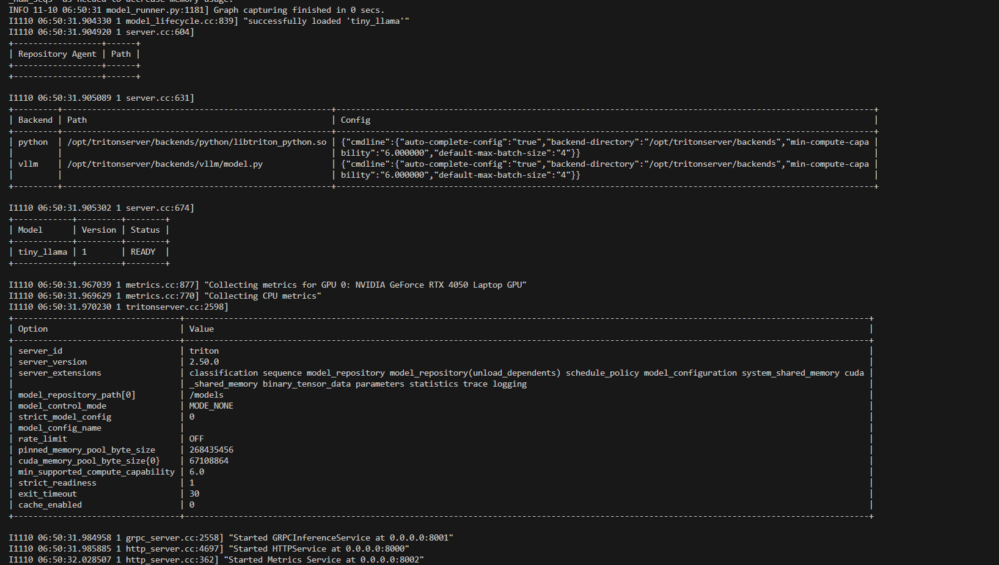
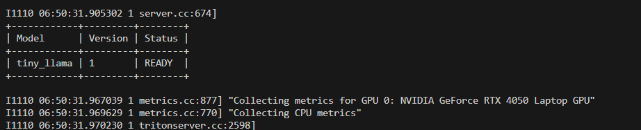
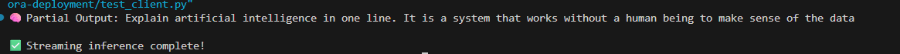

# 🚀 Deploying TinyLlama (vLLM Backend) on NVIDIA Triton Inference Server (GPU)

This documentation explains **how to deploy a lightweight Large Language Model (LLM)** — such as **TinyLlama** — on the **NVIDIA Triton Inference Server** using the **vLLM backend** for GPU-accelerated and streaming text generation.

The steps cover everything from environment setup to successful model inference using gRPC streaming.

---

## 🧱 1. Prerequisites

Make sure your system meets the following requirements before starting:

- **Windows 10/11** with **WSL2 (Ubuntu)**
- **Docker** installed and configured with GPU support
- **NVIDIA GPU** with Compute Capability ≥ 6.0
- **NVIDIA Container Toolkit** installed
- Internet access for pulling Docker images and downloading models

---

## 🧩 2. Project Folder Structure

Organize your files as follows:

```yaml
lora-deployment/
│
├── Dockerfile
├── requirements.txt
├── model_repository/
│   └── tiny_llama/
│       └── 1/
│           └── config.pbtxt
├── vllm_workspace/
│   └── tiny-llama/
└── test_client.py


## 🧠 3. Create Workspace and Download the Model

Before running Triton, create a folder for vLLM models and download the **TinyLlama** model from Hugging Face.

### 🗂️ Create the Folder
**Command:**
```bash
mkdir -p vllm_workspace/tiny-llama
⬇️ Download the Model from Hugging Face
Commands:

bash
Copy code
pip install huggingface_hub
huggingface-cli download TinyLlama/TinyLlama-1.1B-Chat-v1.0 \
  --local-dir ./vllm_workspace/tiny-llama \
  --local-dir-use-symlinks False
This will create the following model structure:

pgsql
Copy code
vllm_workspace/tiny-llama/
 ├── config.json
 ├── tokenizer.json
 ├── generation_config.json
 ├── model.safetensors
✅ This folder will later be mounted inside the Triton container as /workspace/tiny-llama.

⚙️ 4. Create Triton Model Configuration
Inside model_repository/tiny_llama/1/config.pbtxt, define the model details:

Model name

Backend type (vLLM)

Input/output definitions

GPU deployment settings

📋 5. Prepare Requirements File
Create requirements.txt with only the essential dependencies to keep your image lightweight.

Example:

nginx
Copy code
vllm
torch
transformers
accelerate
sentencepiece
huggingface_hub
tokenizers
cmake
numpy
protobuf
pyyaml
🐳 6. Build the Docker Image
Command:

bash
Copy code
docker build -t triton-vllm-light .
This builds a lightweight Triton container with your model repository and vLLM dependencies.

🔐 7. Authenticate with NVIDIA NGC
Since the Triton images are hosted on NVIDIA’s NGC registry, you must authenticate once.

Commands:

bash
Copy code
docker login nvcr.io
Username: $oauthtoken
Password: <your NGC API key>
Generate your API key here: https://ngc.nvidia.com/setup/api-key

🚀 8. Run Triton Server (with GPU)
Use the following command to start Triton:

Command:

bash
Copy code
docker run --gpus all -it --rm \
  -p 8000:8000 -p 8001:8001 -p 8002:8002 \
  -v "$(pwd)/model_repository:/models" \
  -v "$(pwd)/vllm_workspace:/workspace" \
  triton-vllm-light
You should see logs ending with:

nginx
Copy code
tiny_llama | 1 | READY
Started HTTPService at 0.0.0.0:8000
Started GRPCInferenceService at 0.0.0.0:8001
✅ Your model is successfully loaded and running on GPU.

🧩 9. Test the Model Using gRPC Client
Since vLLM uses streaming inference, you must use a gRPC client (not HTTP).

Commands:

bash
Copy code
pip install tritonclient[grpc]
python test_client.py
You’ll receive a live streamed response:

vbnet
Copy code
🧠 Partial Output: Artificial
🧠 Partial Output: intelligence
🧠 Partial Output: is the ability...
✅ Streaming inference complete!
📡 10. Useful Triton Endpoints
Endpoint Type	URL	Description
HTTP	http://localhost:8000	REST Inference API
gRPC	localhost:8001	gRPC Inference API
Metrics	http://localhost:8002/metrics	Prometheus-compatible metrics
Health Check	http://localhost:8000/v2/health/ready	Returns “OK” when Triton is ready

⚙️ 11. Common Issues and Fixes
Problem	Cause	Solution
unable to find backend 'vllm'	Outdated Triton image	Use Triton image 24.09+
decoupled transaction policy	vLLM backend streams output	Use gRPC streaming client instead of HTTP
missing input(s) ['text_input']	Wrong input name in config	Change input name in config.pbtxt and client
501 HTTP not supported	HTTP endpoint doesn’t support streaming	Always use gRPC

🧠 12. Key Learnings
vLLM enables optimized, streaming-based text generation.

Triton Server provides scalable, production-ready model serving.

gRPC streaming is mandatory for LLM backends that use token streaming.

The solution is fully containerized, portable, and GPU-accelerated.

🎯 Final Result
When setup is complete:

Triton Server loads model tiny_llama and status is READY

Model runs on GPU with streaming inference

gRPC client receives live text generation results

🧰 Tools Used
NVIDIA Triton Inference Server 2.50.0

vLLM 0.5.x

PyTorch 2.4.0

CUDA 12.x

Hugging Face Transformers

Triton gRPC Python Client

🏁 Run Summary
Step	Description	Command
1	Build Image	docker build -t triton-vllm-light .
2	Run Triton Server	docker run --gpus all -it --rm -p 8000:8000 -p 8001:8001 -p 8002:8002 -v "$(pwd)/model_repository:/models" -v "$(pwd)/vllm_workspace:/workspace" triton-vllm-light
3	Run gRPC Client	python test_client.py

🧩 Architecture Overview
pgsql
Copy code
 ┌──────────────┐      ┌────────────────────┐      ┌────────────────────┐
 │ User / Client│ ---> │ Triton Inference   │ ---> │ vLLM Backend       │
 │ (Python gRPC)│      │ Server (Docker GPU)│      │ (TinyLlama Model)  │
 └──────────────┘      └────────────────────┘      └────────────────────┘
         ▲                        │
         │                        ▼
     Streaming              GPU-based
     Text Output          Text Generation

🧾 Author Information
Author: Tejas Kakade
Project: vLLM Model Deployment on Triton Server
Objective: End-to-end deployment of an open-source LLM (TinyLlama) using NVIDIA Triton with GPU acceleration and streaming inference.
```

🧠 Example Output:



  Model_up 


  Test_output

---
